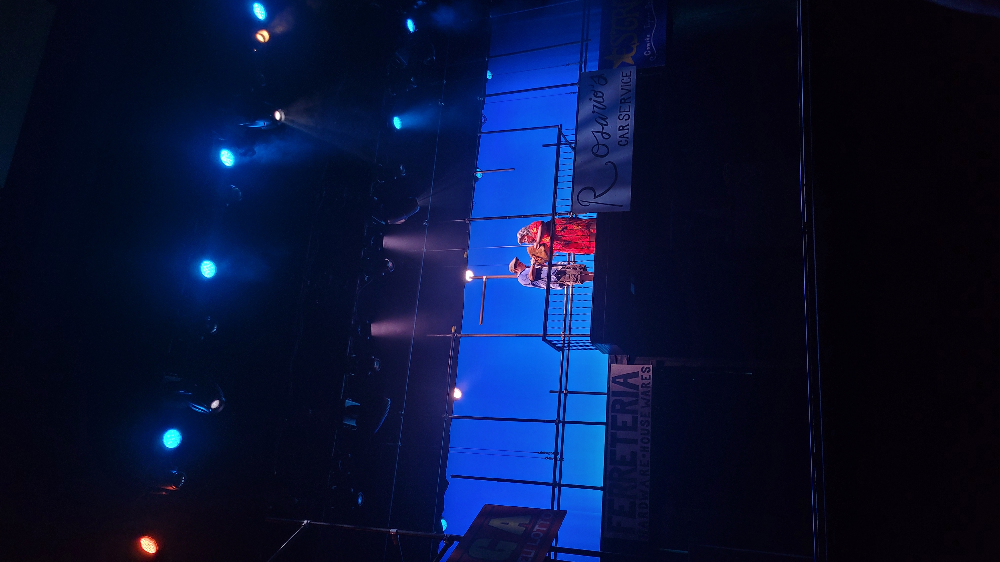
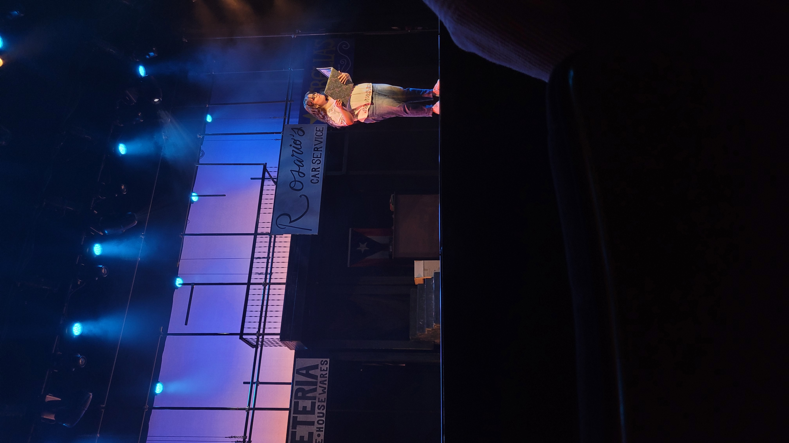
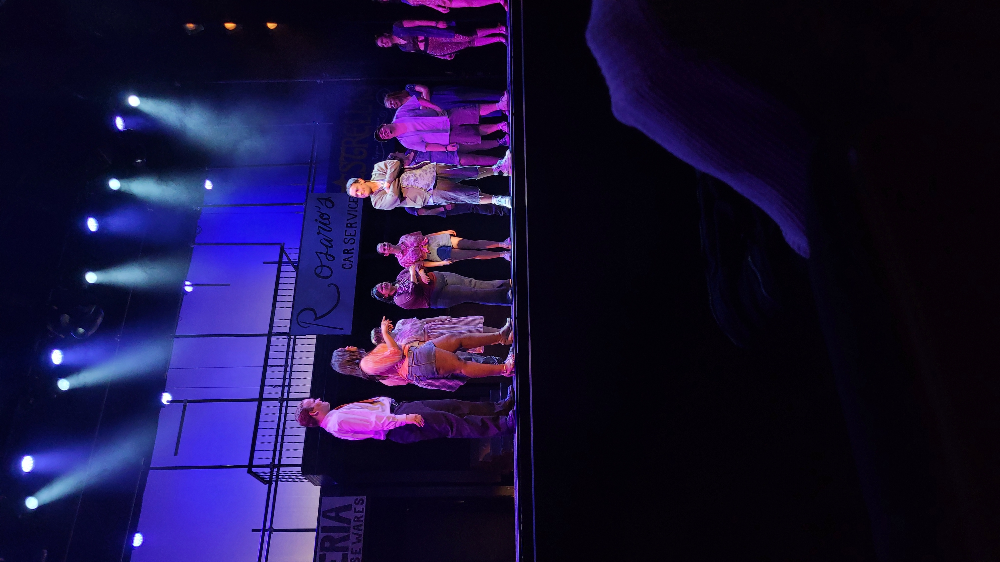

Cornell College Theater Department’s last show of the year, In the Heights, was one of the biggest shows in the department’s history, as well as a fun and exciting musical.

The story follows Usnavi (Luis Ubilla '27), the owner of a small bodega in Washington Heights in New York City; his cousin, Sonny (Joel Abrudiaz '28); his adoptive grandmother, Abuela Claudia (Bianca Rodriguez-Oquendo '27); his love interest, Vanessa (Ava-Leah Ajavon '28); the owners of a local car dispatch, Kevin (Vale Andrade '27) and Camilla (Evaliz Rivera '29); their daughter, Nina (Andrea Sanchez Luna '28); their employee, Benny (Jackson Tressel '27); salon owner, Daniela (Elise Zielinski-Gutierre '27); as well as various other minor characters who show up throughout.

The first act, told through wonderful choreography and vocals, establishes characters, their relationships with each other, and their struggles and motivations. The characters all struggle with money, with all of them taking part in the daily lottery hoping for a winning ticket. In one of the biggest songs of the first act, “96,000,” has a character, later revealed to be Abuela, win $96,000 in the lottery. This song is particularly noteworthy due to the large number of music styles contained within. As each character explains what they’d do with the money, they do so in a slightly different music style that flows together in a truly beautiful way—at times overlapping—all while being backed up by outstanding vocals and choreography. Later on in the act, “The Club/Blackout,” is a masterpiece in vocals and choreography. The song features characters alternating between hip-hop style verses and more traditional showtune style verse, while also mixing many different dance styles together. Half-way through the song, after an outstanding fight scene, the song transitions into a different medley in which the city’s power goes out. Usnavi’s bodega is robbed to the backdrop of 3rd of July fireworks.

The second act focuses on the fallout of the blackout and sees many characters achieve their goals. The highlight of the act was “Carnaval del Barrio,” which featured standout performances by the whole cast, as the characters held a carnival in the street and celebrated, despite the heat. In some of the biggest emotional whiplash I’ve ever seen in a musical before, “Carnaval del Barrio” is immediately followed by “Atención” and “Alabanza” in which we get news that Abuela has died. Then the characters hold a vigil for her, featuring an utterly amazing performance by Luis whose grief was palpable.

All this, not to mention, the amazing costumes and set. Both the ensemble and cast frequently changed their costumes with the time of day. The set was particularly standout, featuring two balconies: stage right and left, as well as an elevated walkway across the entire rear of the stage. The show also featured a staggering amount of lights, including five different follow spots. The orchestra in the pit performed spectacularly with a variety of instruments. Overall, In the Heights was a spectacular musical full of memorable and outstanding performances on all levels.

