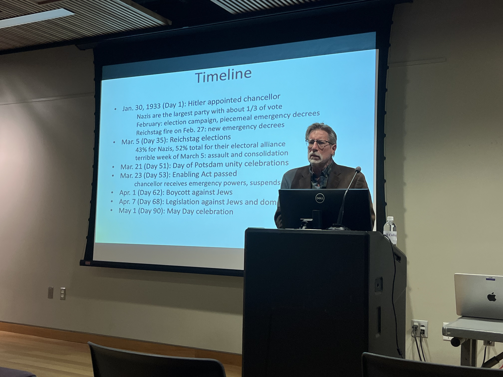
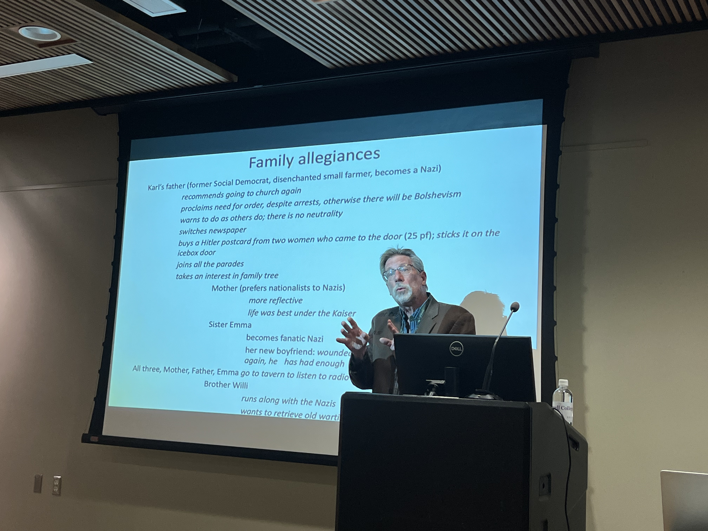

It was the spring of 1933, and an unemployed German draftsman named Karl watched from his window as his neighbors marched through the small town of Hämelerwald square, swept up in a rising tide of national unity. This was the dawn of the Third Reich, as distinguished visiting scholar, Peter Fritzsche, described it.

Fritzsche delivered a lecture titled “I Once Could See, But Now I Am Blind: Bondage in the Third Reich.” Exploring the terrifyingly comprehensible socialization process of Nazification that Hitler used to create the Volksgemeinschaft, or national community, Fritzsche challenged the conventional wisdom that the Germans were coerced into submission by the totalitarian police state. Instead, he argued that the Third Reich relied heavily on popular consent to win over the Germans through propaganda and inspiring a desire to be a part of one’s community. Thus, Fritzsche told the story of how ordinary Germans became Nazis. How shopkeepers, mothers, and fathers embraced a leader and an ideology destined to become known as the most evil in history.

Associate Professor of History and German Studies, Dr. Tyler Carrington, introduced Dr. Fritzsche. This was the 10th straight year that the German Foreign Office has sponsored such an event at Cornell College, Carrington said.

The Nazis broke down old class and religious barriers by promoting marriage between Catholics and Protestants. Fritzsche described how the Nazis also used carefully cropped photos of large crowds to make Germans feel a sense of growing unity. “The choreographed picture becomes more real over time as people take it increasingly seriously,” Fritzsche said.

The Nazis used another method to create that unity, othering a manufactured enemy: the Jews. Nazis conditioned the Germans to accept the persecution of out-groups like the Jews and political dissidents. Fritzsche emphasized that Germans generally didn’t come to Hitler because of hatred for the Jews. Instead, they developed a national hatred for Jews because of Hitler.

He traced the timeline of the winter of 1933, noting that after Hitler was appointed chancellor in January, he quickly won over the people, asking for four years to restore Germany’s greatness. By the March 5 elections, the Nazis’ coalition won a slim majority of 52% in parliament, which—combined with the Reichstag fire a week earlier and a ramping up of street violence against the Communists—was enough to allow them to declare a state of emergency and push through the “Enabling Act,” thus suspending the constitution and making Hitler dictator. Then came a rapid and violent consolidation of power that led to the Nazis seizing complete control over Germany, invading their neighbors, and beginning World War II.

Through Karl’s diary entries, Fritzsche painted a portrait of a society in flux, where neighbors constantly reassessed each other’s political allegiances. If a hairdresser or postman suddenly began greeting with the Nazi salute, Karl and others were left wondering if their neighbors had become Nazis out of true conversion or mere opportunism to save their livelihoods. Hämelerwald, like the rest of Germany, had become a disorienting gray zone of compliance.

Fritzsche described what he called “entangled histories,” asserting that few people in Nazi Germany were completely victims or villains. He described how ordinary citizens became entangled in the regime’s atrocities through small, daily acts of conformity. Conformity became the only way to get or keep a job, to feel a part of the soaring national unity, or to avoid the ire of the ubiquitous Brownshirts (the Sturmabteilung, or Storm Troopers).

He closed the lecture by suggesting that it may be difficult, but it is better if we all explore and confront the tangled histories of our ancestors.

“What fascism threatened was the estrangement from the nation, the community... and finally, fascism threatened estrangement from one’s own self,” Fritzsche said, noting how this environment of suspicion forced individuals to doubt their own perceptions. “In this world of masks, I once could see, but now I’m blind.”

During the question-and-answer segment, when asked how modern societies can prevent similar radicalization, Fritzsche offered a simple, challenging moral compass: practice the Golden Rule. Preventing a slide into fascism, he suggested, is as simple as empathizing with those around us.

The lecture served as a stark warning about how easily a society can be socialized into accepting authoritarianism when it’s packaged as patriotism and national renewal.