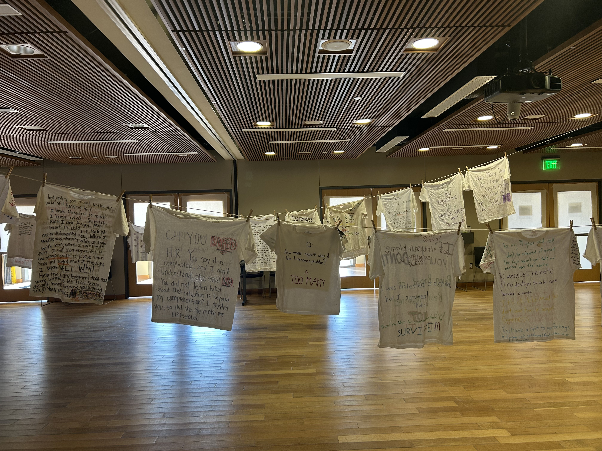
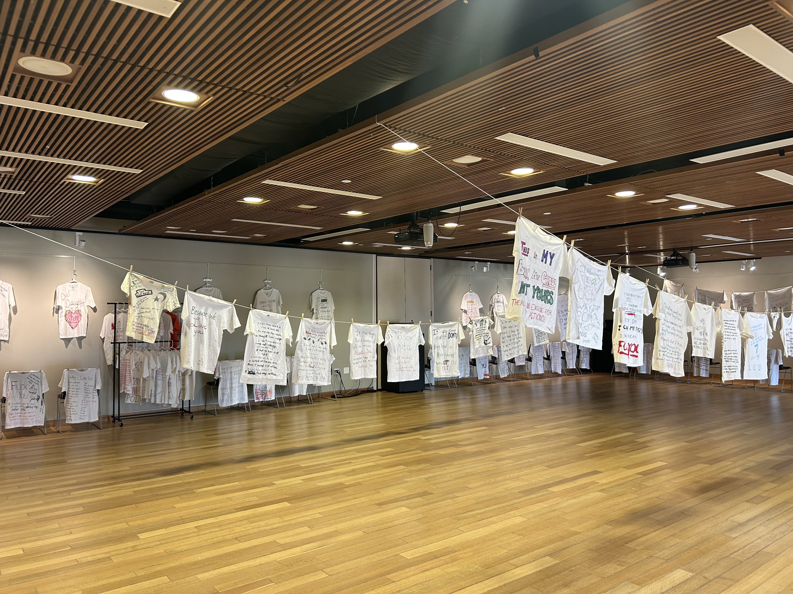
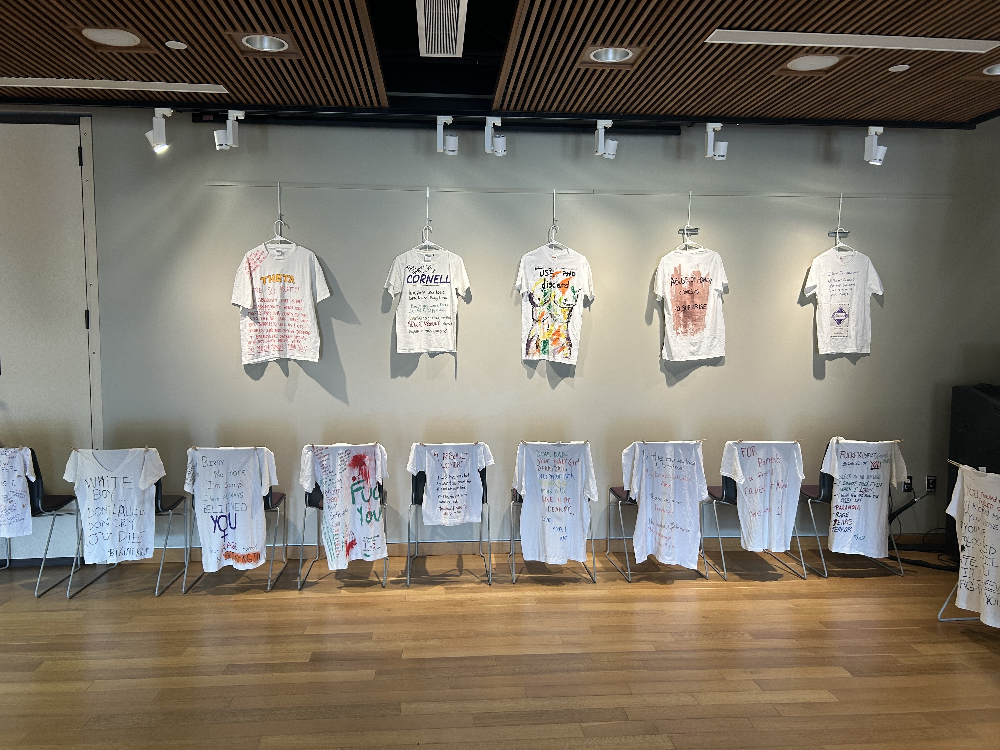

From Thursday, April 16th to Friday, April 17th, the Third Wave Feminist Resource Group (TWRG) showcased dozens of t-shirts in Hall-Perrine, each shirt displaying testimonies and messages by victims of sexual assault. First conceptualized in the year 1990 by Massachusetts-based artist Rachel Carey-Harper, The Clothesline Project is a nationally recognized exhibition intended to bring awareness to sexual violence while also providing a creative outlet for people to share their stories and heal. TWRG has continued the tradition here at Cornell, including after the organization’s revival last year.

While the exhibit can be incredibly empowering and healing for those who choose to engage with its contents, it can be uncomfortable and/or triggering for those who would rather avoid it, or only engage with the project once they feel prepared. This year, the exhibit was held in Hall-Perrine rather than the Orange Carpet, which was where it was held last year. Because Hall-Perrine is more secluded than the Orange Carpet, and because TWRG provided content warnings through visible signage, viewers could be more intentional about engaging with the project and its content. Hall-Perrine additionally has less foot traffic, meaning that viewers could have more privacy. They could stay for as long as they needed without growing concerned about being perceived.

The Clothesline Project not only leaves an impact on viewers, but also its contributors. Speaking up, especially when navigating sexual assault, can be incredibly challenging—the project acknowledges this and offers victims a sense of anonymity and creative freedom, allowing them to give a voice to their experiences. As stated by TWRG Co-Presidents, Anya Wendt '28 and Cora Wynsma '28, “Our hope for The Clothesline Project is that people will be able to see the impact that sexual assault and violence have on people. It is still a problem on college campuses everywhere, including ours. We hope students who may have stories of their own will feel that they are not alone in their experiences.”

Even after the exhibit’s deinstallation, TWRG will continue to provide support for students on campus. Gracie Stevens '28, TWRG’s sexual assault advocacy representative, serves as a resource for students to talk to confidentially and helps students initiate contact with off-campus resources like the Riverview Center, should the student request it. Ebersole Health and Wellbeing Center also provides a range of services relating to sexual health, mental health support, and more. For more information, email TWRG at twrg@cornellcollege.edu.

