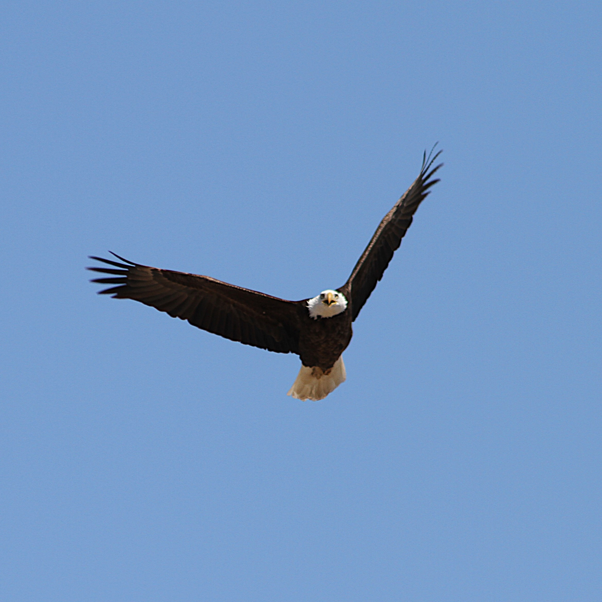
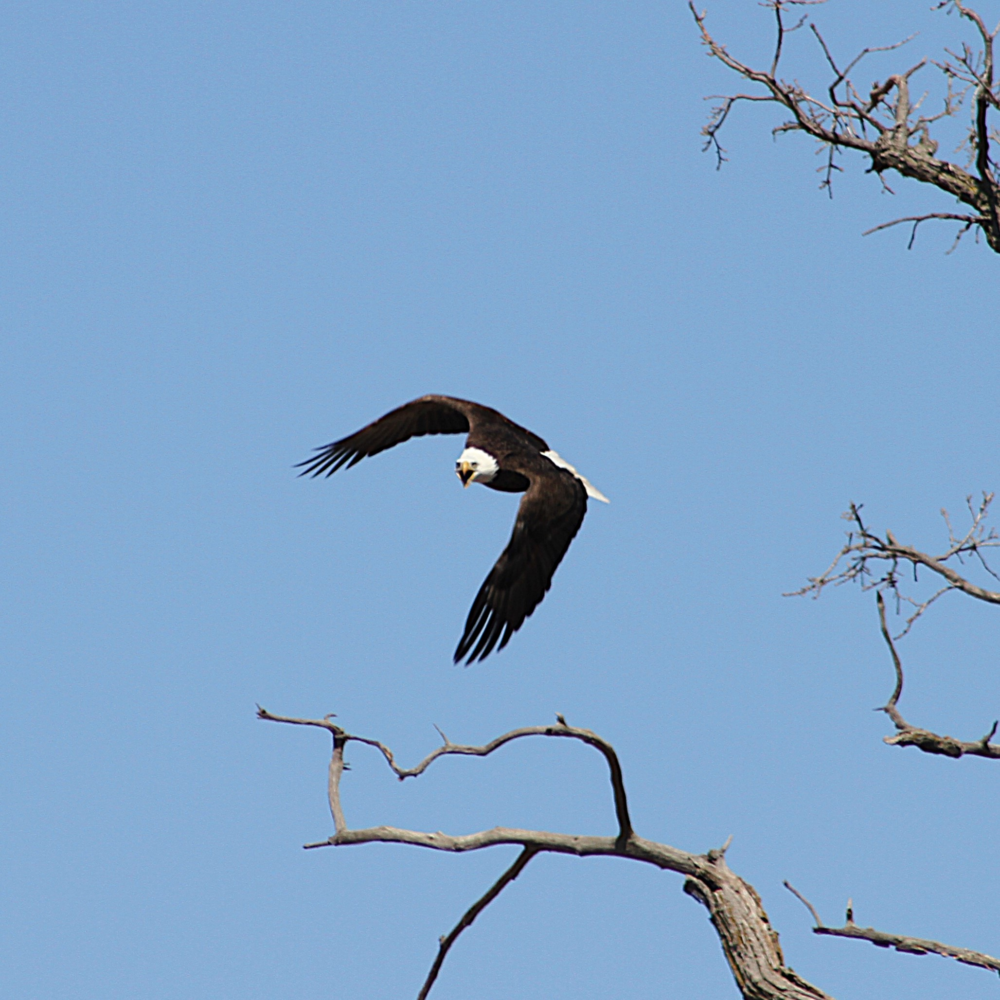
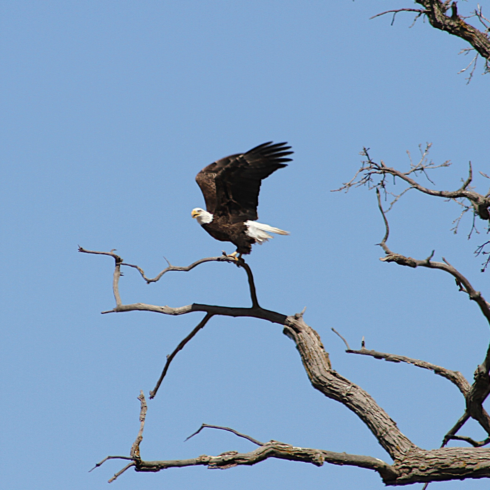

On April 6, as I was leaving the campus area and heading past the Mount Vernon Police Department building, I noticed what looked like a large nest in a tree. I had seen bald eagles flying around outside of campus and had always wondered where their nest was. I got excited and quickly went to the police department’s parking lot and got my camera to see what I could find.

I was lucky enough to be there when an eagle was in its nest. The tree sits in the middle of some farmland and the field has been harvested, providing a clear line of sight to the tree and the eagle’s nest. The tree is far enough away, so it is hard to get a good picture of the bald eagles or their nest. However, the nest is a wonderful sight, and it is fun to see eagles so close to campus.

A man I met while taking pictures told me that the nest has been in use for several years now. He mentioned that a pair of eagles used the nest and that any eggs should have hatched at this point. This seems to indicate that Mount Vernon will hopefully have their own pair of eagles for a long time. Hopefully, this information inspires both excitement and awe in the Cornell community. But we should all remember that we must respect these animals and keep a safe distance, so we do not stress or upset the animals or drive them away. These eagles are one of the many exciting birds that I have seen on and around campus. Cornell is lucky to be a space where we can see nature so close, and I hope that Cornell and the Mount Vernon community will continue to make this area a space where nature can live where we can be lucky enough to see them.

